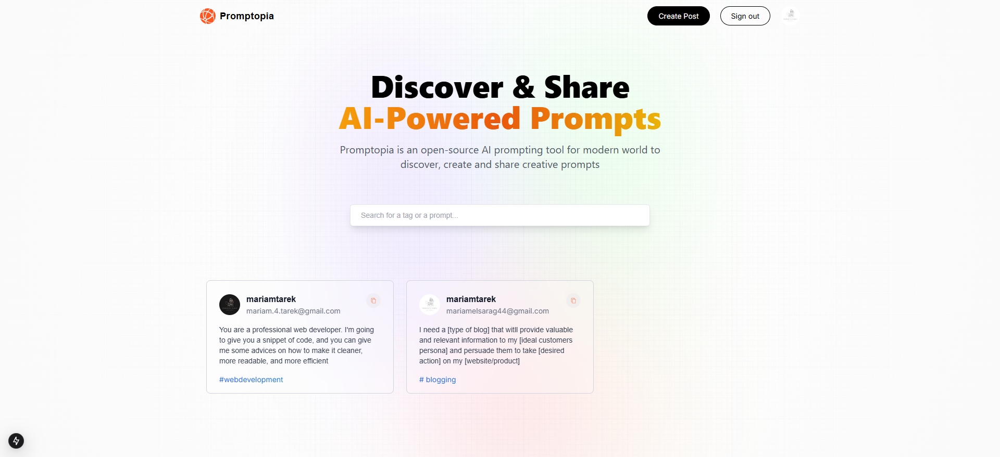
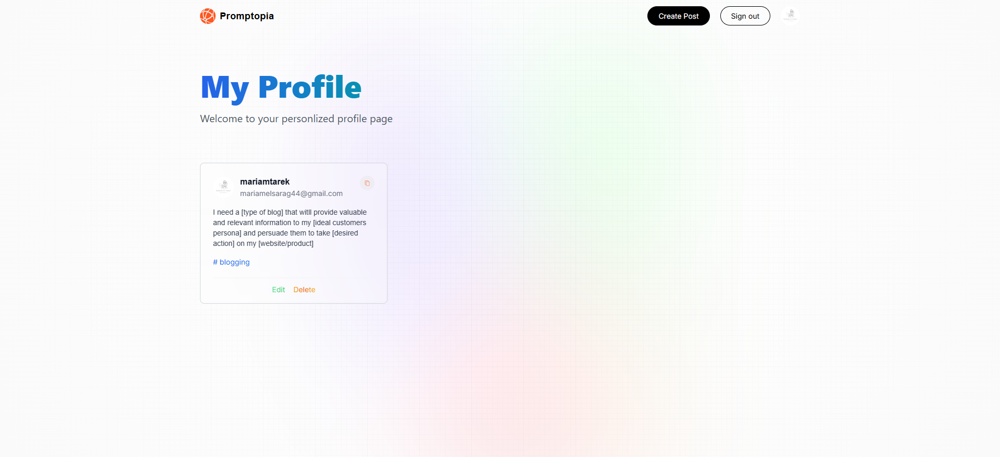
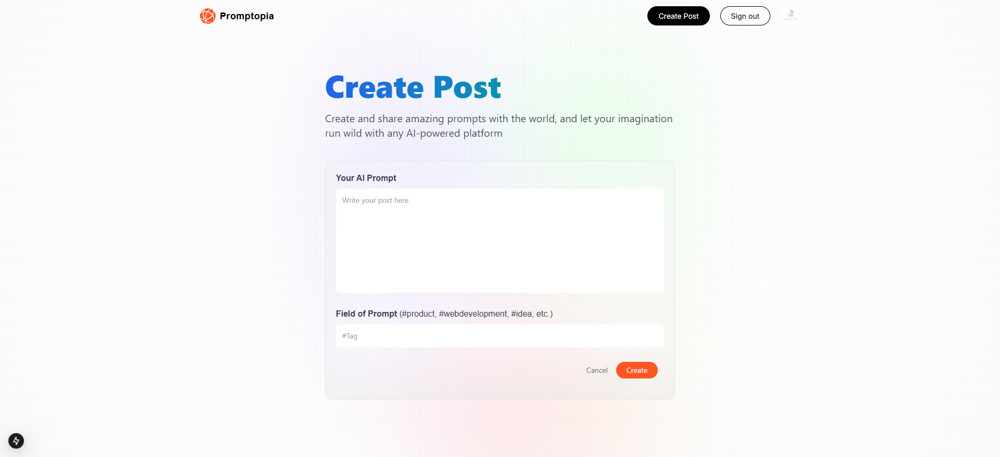

# Prompoita

## 📋 Overview

Prompoita is a platform where users can create, share, and discover prompts. Users can post prompts, browse prompts from other users or guests, copy prompts, and manage their own posts. Authentication is handled via NextAuth.

## ✨ Features

- **User Posts:** Users can create new prompts.
- **Search & Copy:** Guests or registered users can search for prompts and copy them.
- **Post Management:** Users can edit or delete their own posts.
- **Authentication:** User authentication and session management using NextAuth.

---

## 📷 Screenshots & Demo

### Home / Feed

  
Users can browse prompts, search by tags, and copy prompts to their clipboard.

### Profile / User Posts

  
Users can see their own prompts and have the ability to edit or delete them.

### Create / Edit Prompt

  
Authenticated users can create new prompts or edit existing ones.

---

## 🛠️ Tech Stack

- **Next.js** – React framework for frontend and server-side rendering
- **MongoDB & Mongoose** – Database for storing users and posts
- **NextAuth** – Authentication and session management

---

## Project Structure (overview)

```text
├── app/
│   ├── api/                # Next.js API routes
│   ├── components/         # React components
│   ├── _lib/               # Data service utilities
│   └── page.tsx            # Main pages
├── models/                 # Mongoose models
├── utils/                  # Helper utilities
├── .env.local              # Environment variables
├── package.json
└── README.md
```

---

## 🧪 Configure environment variables

Create a `.env` file in the project root (or set these variables in your deployment environment).

```bash
NEXT_PUBLIC_APP_URL=""

# google auth
GOOGLE_CLIENT_ID=""
GOOGLE_CLIENT_SECRET=""

# database
MONGODB_URI=""
MONGODB_PASSWORD=""

# config next auth
NEXTAUTH_URL=http://localhost:3000
NEXTAUTH_URL_INTERNAL=http://localhost:3000
NEXTAUTH_SECRET=""

```

---

## ⚙️ Project Setup

Follow these steps to run the project locally:

### 1- MongoDB Setup

Before running the project, make sure you have a running MongoDB instance:

#### Option 1: Local MongoDB

1. Install MongoDB: [https://www.mongodb.com/docs/manual/installation/](https://www.mongodb.com/docs/manual/installation/)
2. Start the MongoDB service:
   ```bash
   MONGODB_URI=mongodb://localhost:27017/prompoita
   ```

### Option 2: MongoDB Atlas (Cloud)

1. Sign up or log in at [MongoDB Atlas](https://www.mongodb.com/cloud/atlas).
2. Create a **New Project**.
3. Inside the project, create a **New Cluster** (select the free tier if needed).
4. Wait for the cluster to deploy (usually a few minutes).
5. Add a **database user** with a username and password.
6. Whitelist your IP address in the **Network Access** settings.
7. Get your connection string by clicking Connect → Connect your application, and copy the URI:

> ⚠️ Make sure the cluster is running and your IP is whitelisted before starting the project.  
> If you encounter connection issues, double-check the URI, username/password, and network access settings.

### 2- Clone the repository

```bash
git clone <repository_url>
cd <project_directory>
```

### 3- Install dependencies:

```bash
npm install
```

### 4- Start the development server

```bash
npm run dev
```

## Build for production

```bash
npm run build
npm run start
```

## Usage Notes

- Only the creator of a post can delete or edit it.
- Other users can search for prompts and copy them to the clipboard.
- Authentication is handled via NextAuth, currently configured with Google OAuth.
